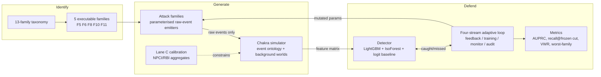
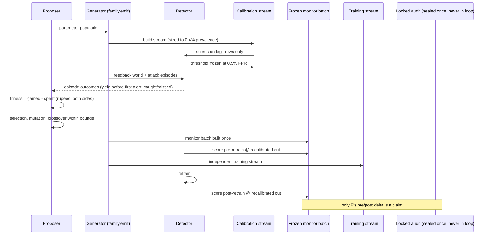
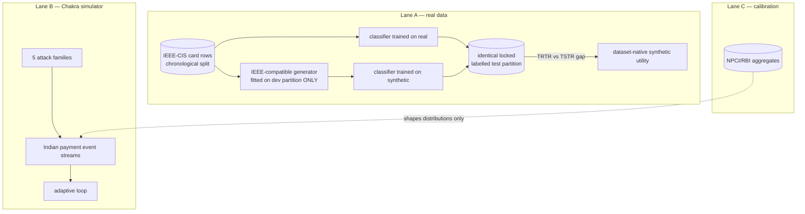
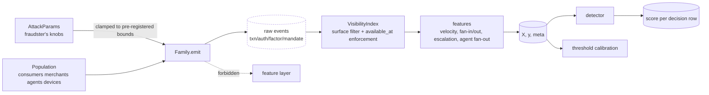
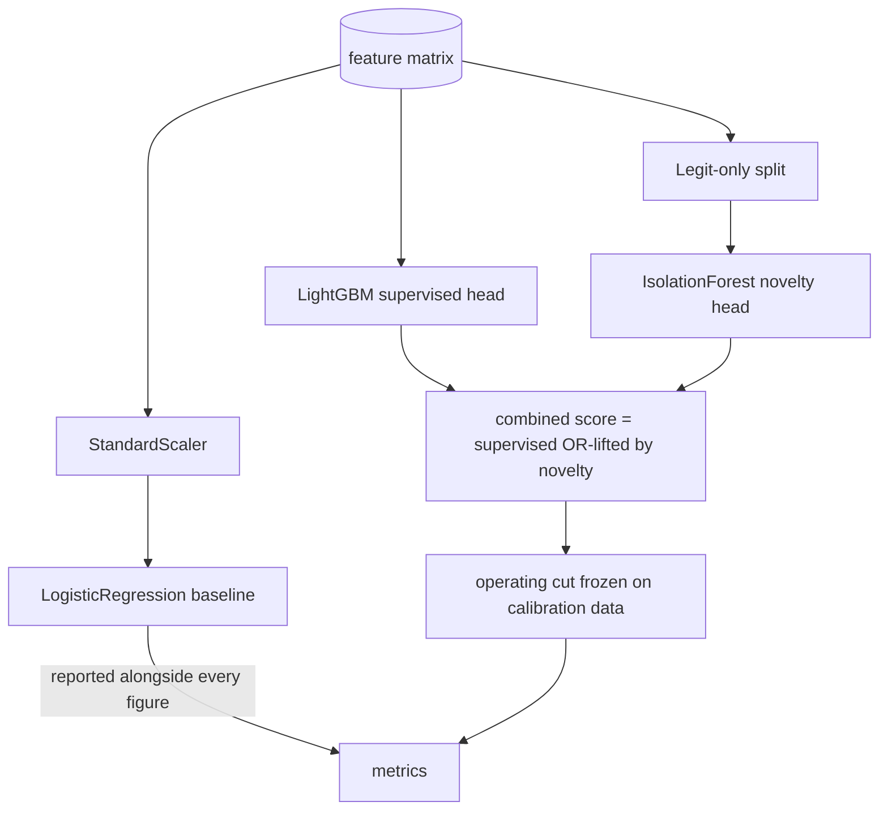
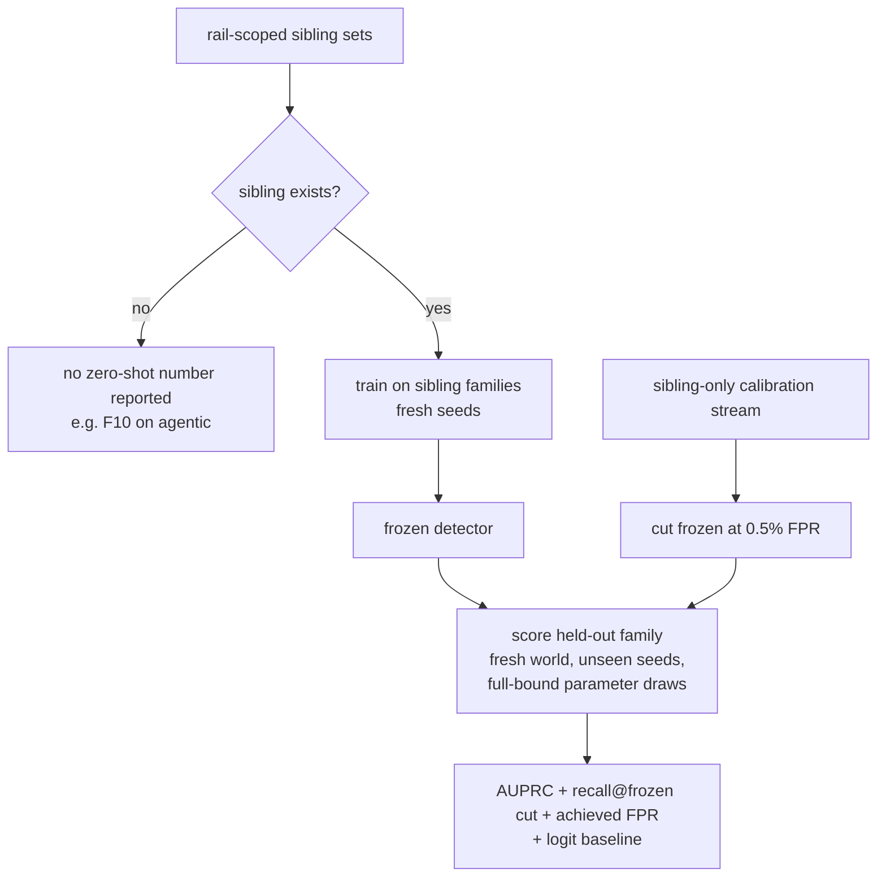
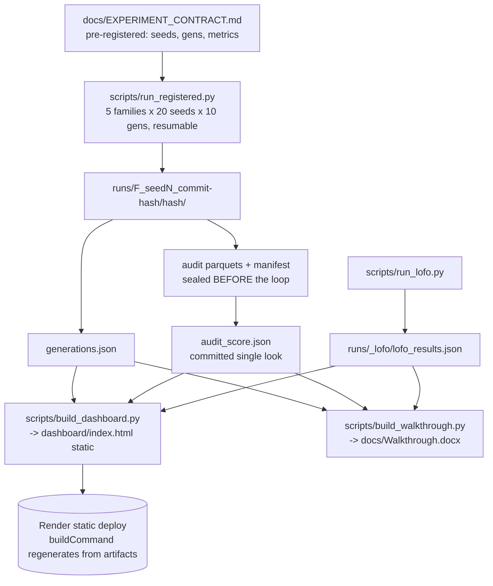
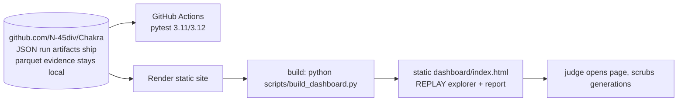
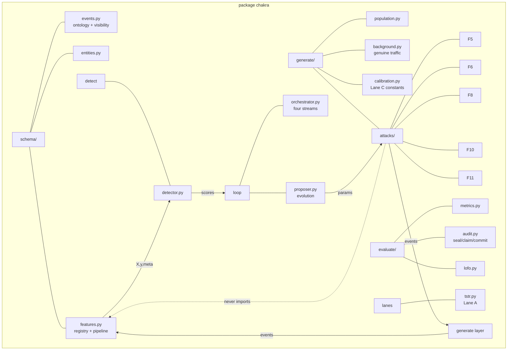
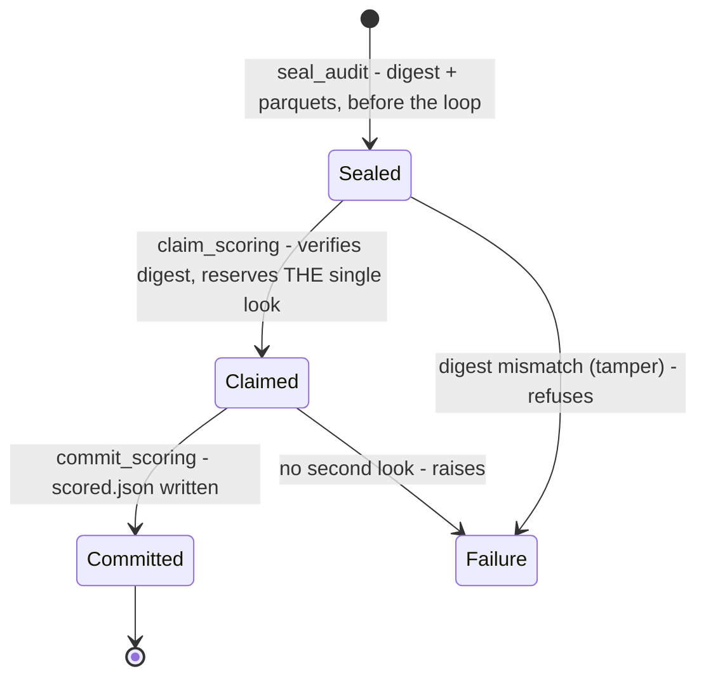

# Chakra — Architecture

End-to-end blueprint of the closed-loop adversarial fraud range. Component
diagrams in Mermaid; any PDF/docx renderer that supports Mermaid will show
them natively, and GitHub renders them in the repo view.

---

## 1. The system at a glance

One loop, three pillars, three data lanes. Everything else is machinery to
keep the loop honest.

The red path is what makes it adversarial: the attacker consumes its own
failures. Detector → caught/missed → attacker mutates → generator emits →
detector retrains. Improvement is read on frozen monitor batches neither side
trained on.

## 2. One generation of the loop

Five streams in four roles: calibration drives the threshold, feedback drives
the attacker, training drives the detector, monitor carries the improvement
claim, and the audit is scored exactly once at the end — sealed, hash-verified,
persisted before the loop starts.

## 3. Data lanes — never conflated

Lane A validates *dataset-native* synthetic utility and nothing about the
Indian families; it says so in the README, the deck and the walkthrough.

## 4. From attack idea to detector row

The forbidden edge is enforced by a test (`tests/test_no_feature_injection.py`)
so the detector learns fraud, never the generator's author.

## 5. Detector stack

The novelty head exists to catch a share of a family the supervised head has
never seen — the LOFO narrative's second act. The baseline proves gains.
Thresholds are cut on calibration data at the target false-positive budget;
the *achieved* FPR is reported beside every recall.

## 6. Zero-shot (LOFO) protocol

The rail-scoping rule matters: a detector can only be held out from families
it could ever see on its own rail, otherwise the number measures rail mismatch
(FINDINGS F-004).

## 7. Experiment lifecycle — from contract to published number

Run directories embed the code version hash so a score can never be attributed
to different source than the audit beside it. Dashboards and documents read
only these artifacts — a missing artifact renders as missing, never as a
placeholder number.

## 8. Web prototype (deployment shape)

Static by design: no server to cold-start, nothing that can fail in the room.
Recorded runs are labelled REPLAY on screen per the experiment contract.

## 9. Module map

Dependency discipline in one picture: `generate/attacks` may build entities and
events, but the arrow to `schema/features` does not exist. Train, calibrate and
evaluate all read the same feature pipeline — the one that runs on real data.

## 10. Audit integrity state machine

The audit stream is built once, scored once, and its digest is persisted
before any result exists — a judge can re-verify a published number without
trusting anything but the artifact it came from.